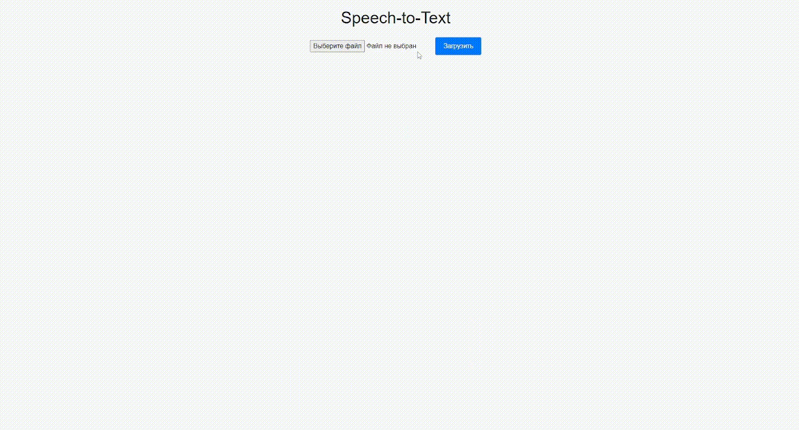

# Speech-to-Text

**Содержание:**
- [Необходимые компоненты](#Необходимые-компоненты)
- [Создание виртуального окружения](#Создание-виртуального-окружения)
- [Установка необходимых библиотек](#Установка-необходимых-библиотек)
- [Установка DeepSpeech-2](#Установка-DeepSpeech-2)
- [Запуск Веб-Интерфейса](#Запуск-Веб-Интерфейса)

## Необходимые компоненты

* [Python 3.6](https://www.python.org/)
* Mac or Linux environment (Мы используем Anaconda) (https://www.anaconda.com/download)


## Создание виртуального окружения

Для корректной работы нам необъодим Python версии 3.6, установим его при помощи Anaconda:

```bash
conda create --name py36 python=3.6
```

После создания окружения нам необходимо его активировать:

```bash
conda activate py36
```

## Установка необходимых библиотек

Воспользуемся requrements.txt для установки необходимых библиотек:

```bash
pip install -r requirements.txt
```

## Установка DeepSpeech2

Для установки DeepSpeech2 скачайте репозиторий:

```bash
git clone https://github.com/cogmeta/DeepSpeech-2.git
```

Для корректной работы DeepSpeech нужно установить предобученные модели:

```bash
cd DeppSpeech-2
```

```bash
curl -LO https://github.com/mozilla/DeepSpeech/releases/download/v0.9.3/deepspeech-0.9.3-models.pbmm
curl -LO https://github.com/mozilla/DeepSpeech/releases/download/v0.9.3/deepspeech-0.9.3-models.scorer
```

Загрузить примеры аудио файлов:

```bash
curl -LO https://github.com/mozilla/DeepSpeech/releases/download/v0.9.3/audio-0.9.3.tar.gz
tar xvf audio-0.9.3.tar.gz
```

Как только все будет установлено, вы сможете использовать двоичный файл deepspeech для преобразования речи в текст в коротких, примерно 5-секундных аудиофайлах (в настоящее время в клиенте Python поддерживаются только файлы WAV с 16-битным разрешением, 16 кГц, mono).:

```bash
pip3 install deepspeech
```
## Запуск Веб-Интерфейса

Запуск происходит при помощи app.py находящийся в папке backend:
```bash
python backend/app.py
```

После успешного запуска Веб-Интерфейса переходим по адресу:
```bash
http://127.0.0.1:5000/
```



### Авторы:
Савенков Дмитрий, Дарья Лоткова МПИ-23-1-2
